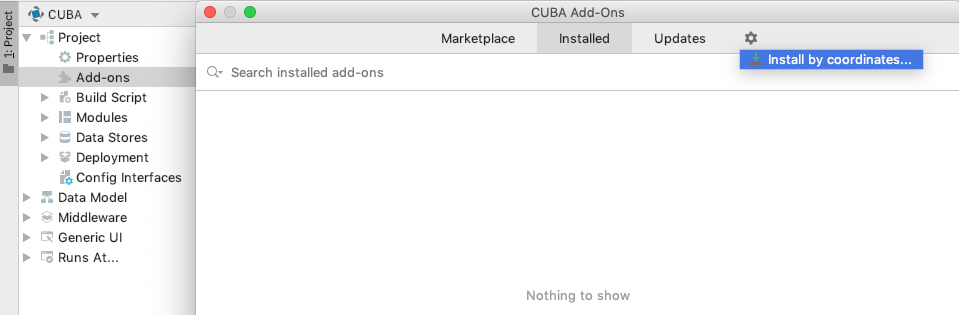
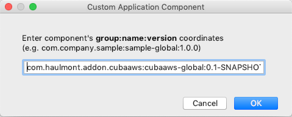

[](http://www.apache.org/licenses/LICENSE-2.0)

# Overview

CUBA Amazon Add-on enables using supported AWS services, for now it supports:
* Amazon Simple Storage Service (S3)

# Installation

1. Open your application in CUBA Studio.

2. Double-click *Add-ons*.

3. Click the *Gear* button and select *Install by coordinates* item.

    

4. Specify the coordinates of the component in the corresponding field as follows: group:name:version.

   

   * Artifact group: *com.haulmont.addon.cubaaws*
   * Artifact name: *cubaaws-global*
   * Version: *add-on version*

# Amazon S3 File Storage configuration

 Add the following line into `spring.xml`:
 ```xml
     <bean name="cuba_FileStorage" class="com.haulmont.addon.cubaaws.s3.AmazonS3FileStorage"/>
 ```

 Add the following properties into `app.properties`:

 * **cuba.amazonS3.accessKey**: Amazon S3 access key

 * **cuba.amazonS3.secretAccessKey**: Amazon S3 secret access key

 * **cuba.amazonS3.region**: Amazon S3 region

 * **cuba.amazonS3.bucket**: Amazon S3 bucket name

 * **cuba.amazonS3.chunkSize** (optional): Amazon S3 chunk size

 * **cuba.amazonS3.endpoint** (optional): Custom Endpoint for S3. Useful for S3 compatible S3 storage

 **Example:**
 ```ini
 cuba.amazonS3.accessKey = AAAABBBBCCCCDD11CC22
 cuba.amazonS3.secretAccessKey = AbCD+eFFGK3iAB9Ca9BCAB7ddDDABcabCabc9aBC
 cuba.amazonS3.region = eu-north-1
 cuba.amazonS3.bucket = s3-ec2-test
 cuba.amazonS3.chunkSize = 5500
 ```

 **Example for Yandex Cloud Object storage**
 ```ini
 cuba.amazonS3.accessKey = AAAABBBBCCCCDD11CC22
 cuba.amazonS3.secretAccessKey = AbCD+eFFGK3iAB9Ca9BCAB7ddDDABcabCabc9aBC
 cuba.amazonS3.region = ru-central1
 cuba.amazonS3.bucket = test
 cuba.amazonS3.chunkSize = 5500
 cuba.amazonS3.endpoint = https://storage.yandexcloud.net